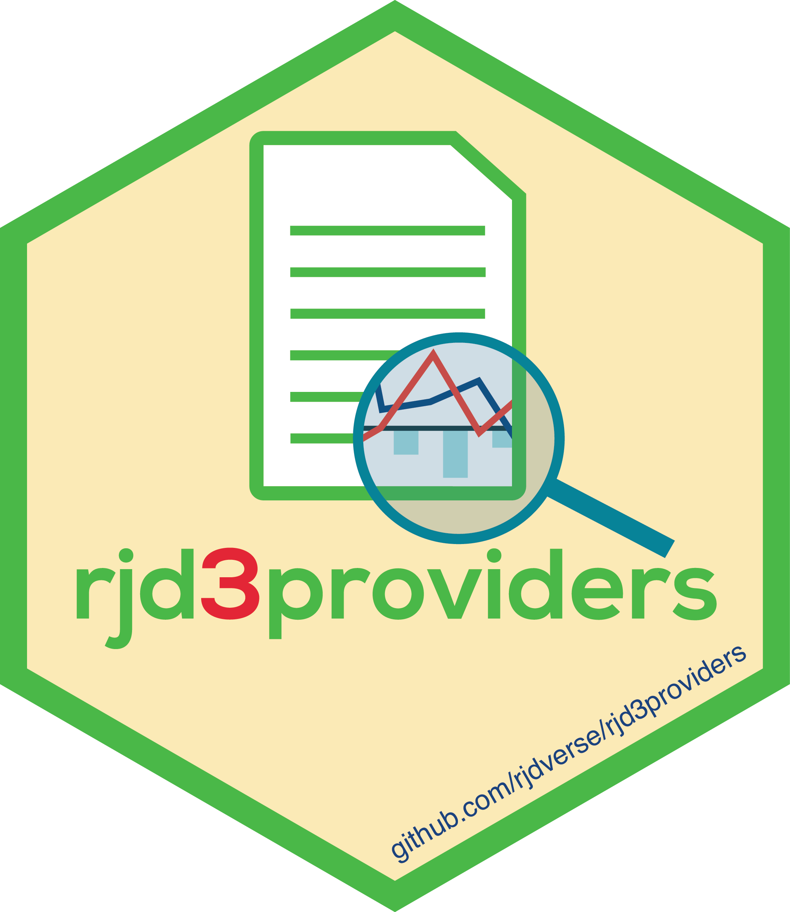

<!-- README.md is generated from README.Rmd. Please edit that file -->

```{r, include = FALSE}
knitr::opts_chunk$set(
    collapse = TRUE,
    comment = "#>",
    fig.path = "man/figures/README-",
    out.width = "100%"
)
```

# {rjd3providers} <a href="https://rjdverse.github.io/rjd3providers/"></a>

<!-- badges: start -->
[](https://CRAN.R-project.org/package=rjd3providers)
[](http://www.awesomeofficialstatistics.org)

[](https://github.com/rjdverse/rjd3providers/actions/workflows/R-CMD-check.yaml)
[](https://github.com/rjdverse/rjd3providers/actions/workflows/lint.yaml)

[](https://github.com/rjdverse/rjd3providers/actions/workflows/pkgdown.yaml)
<!-- badges: end -->


## Overview

**{rjd3providers}** provides tools to explore the default time series providers (.xslx, .csv, .txt and .xml files) for JDemetra+ v3.x Graphical User Interface. It allows to manipulate raw series files. For example, using this R package, you will be able to:

- change the **path** of the raw data
- change the file **type**
- manipulate **monikers**
- change file **read properties**


## Installation

**{rjd3providers}** relies on the [**{rJava}**](https://cran.r-project.org/web/packages/rJava/index.html) package.

Running rjd3 packages requires **Java 17 or higher**. How to set up such a configuration in R is explained [here](https://jdemetra-new-documentation.netlify.app/#Rconfig) 


### Latest release

To get the current stable version (from the latest release):

- From GitHub:

```{r, echo = TRUE, eval = FALSE}
# install.packages("remotes")
remotes::install_github("rjdverse/rjd3providers@*release", build_vignettes = TRUE)
```

- From [r-universe](https://rjdverse.r-universe.dev/rjd3providers):

```{r, echo = TRUE, eval = FALSE}
install.packages("rjd3providers", repos = c("https://rjdverse.r-universe.dev", "https://cloud.r-project.org"))
```

### Development version

You can install the development version of **{rjd3providers}** from [GitHub](https://github.com/) with:

```{r, echo = TRUE, eval = FALSE}
# install.packages("remotes")
remotes::install_github("rjdverse/rjd3providers")
```


## Usage

### Generate all the TS information 

``` {r generate_info, echo = TRUE, eval = TRUE}
library("rjd3providers")

xlsx_file <- paste0(system.file("examples", package = "rjd3providers"), "/Insee.xlsx")
spreadsheet_content(xlsx_file)

ts1 <- spreadsheet_series(file = xlsx_file, sheet = 1L, series = 3)
str(ts1)

all_ts <- spreadsheet_data(file = xlsx_file, sheet = 2L)
```


## Package Maintenance and contributing

Any contribution is welcome and should be done through pull requests and/or issues.
pull requests should include **updated tests** and **updated documentation**. If functionality is changed, docstrings should be added or updated.


## Licensing

The code of this project is licensed under the [European Union Public Licence (EUPL)](https://interoperable-europe.ec.europa.eu:443/collection/eupl/eupl-text-eupl-12).
